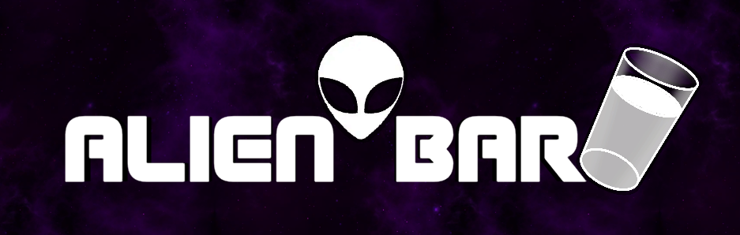

# Alien Bar

**Alien Bar** is a bartending game where ingredients have to be combined to form recipes, which are then delivered to clients. This game is similar to [Cook, Serve, Delicious!](https://www.cookservedelicious.com/yum/) or [Overcooked!](https://www.team17.com/games/overcooked/) , in the sense that it is a continuous game where players use ingredients to form recipes. Yet, unlike those games, all the ingredients and utensils presented in-game have fictitious names (e.g. _Thirpunasorec_ and _Orgeine_), and the mechanics are built in such a way that in-game tasks become memory puzzles that do not require previous player knowledge. A [video](https://youtu.be/F0gqm1vBTV8) explaining the core mechanics of the game is available online.

In total, the game considers five difficulty levels. Yet, the levels considered by the game depend on the game mode. Each difficulty level comprehends a set of recipes, and relies on the steps and mechanics needed to generate them. During gameplay, three game modes can be selected in the main menu of the game: _Tutorial_, _Training_, and _Survival_. _Tutorial_ presents only recipes from the first level, and has a fixed duration; _Training_ also has a fixed duration, but throughout this phase, the player is free to start any level and play for as long as they want; and in _Survival_, the game starts from the first level, and progressively increases its level until either a maximum duration is reached or the pending orders zone gets full. Unlike in _Survival_, orders in both _Tutorial_ and _Training_ are generated every time the player delivers a pending order, so that the orders area is always full. Finally, in _Survival_, an order is generated every time there are no pending orders left to deliver. 

## Executing the game

To execute the game (in Windows), only two steps are required:
- Download the latest version of **Alien Bar** through git pages of this repository: [https://samgomes.github.io/alien-bar/](https://samgomes.github.io/alien-bar/)
- Extract the folder and click on the executable (AlienBar.exe)

For other platforms, the code can be also downloaded and re-built.

## Game designed and developed by:
- Samuel Gomes - [@SamGomes](https://github.com/SamGomes)
- Luis Costa - [@luisfcosta2015](https://github.com/luisfcosta2015)

## License
The current and previous versions of the code are licensed according to Attribution 4.0 International (CC BY 4.0).  
 
  
